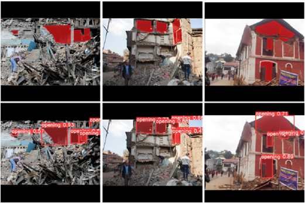

# Towards Fully Autonomous UAV: Damaged Building Opening Detection for Outdoor-Indoor Transition in Urban Search and Rescue

## Authors
Ali Surojaya, Ning Zhang, John Ray Bergado, Francesco Nex
  
# Introduction
This repository contains the dataset and source code of our damaged building opening detection paper.

# Dataset and Pre-trained Model
We provide the dataset of damaged building opening. You can use them to fine-tune your own damaged building opening detection.

Damaged building opening dataset: [download here](https://drive.google.com/file/d/1ICFUPZ7qpDxET0ZfvjuEcoYqgQeN4IYJ/view?usp=sharing)

Pre-trained damaged building opening detection model: [YOLOv5-MTL](https://drive.google.com/file/d/1EdQMgeCB8GG1j-spf2FcklV7HY8zhlk8/view?usp=sharing), [YOLOv5single](https://drive.google.com/file/d/1TEEnCnfSYTMLBEGnLcTTatcB3B301BFU/view?usp=sharing)

# Training and Prediction
We documented the training process and prediction workflow on Google Colaboratory (YOLOv5_MTL_Project.ipynb).
